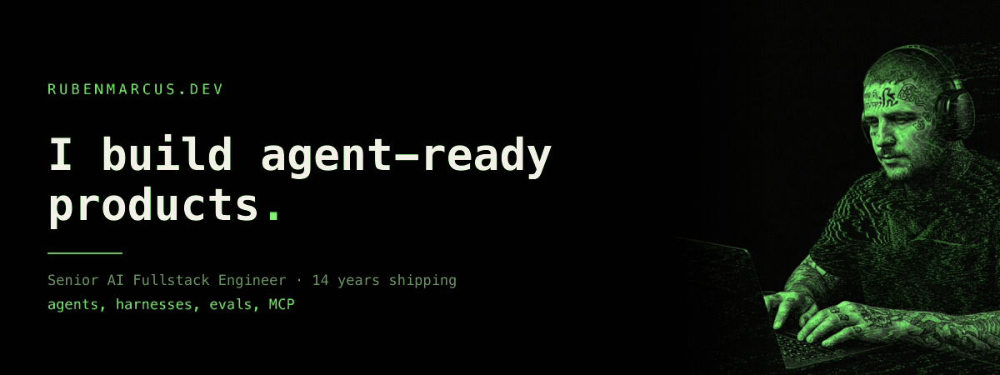

<p align="center">
  <a href="https://www.rubenmarcus.dev">
    
  </a>
</p>

<p align="center">
  <a href="https://www.rubenmarcus.dev"></a>
  <a href="https://www.rubenmarcus.dev/connect"></a>
  <a href="https://www.rubenmarcus.dev/cv.pdf"></a>
  <a href="https://linkedin.com/in/rubenmarcus"></a>
  <a href="mailto:ruben@rubenmarcus.dev"></a>
</p>

---

Senior AI Fullstack Engineer in Lisbon, remote worldwide. 14 years shipping — 4+ deep in web3, 2+ building AI developer tools. I build AI-native products, agent tooling, and the harnesses that keep them honest: bounded specs, isolated worktrees, evals that fail closed.

**My portfolio speaks MCP.** Point your agent at `https://www.rubenmarcus.dev/api/mcp` and let it read this résumé instead of you — [setup below](#read-me-with-your-agent-mcp).

---

## Building now

| Project | What it is |
| --- | --- |
| **[Ralph Starter](https://ralphstarter.ai)** | Open-source AI coding orchestrator. Swarm mode — race / consensus / pipeline over isolated git worktrees — plus an MCP server and a Figma→code visual validation pipeline. |
| **[Autoresearcher](https://autoresearcher.org)** | Benchmark-driven autonomous research CLI. Divergent agent populations in isolated worktrees, champion merging, a Pareto frontier of candidates, keep/reject validity gating. |
| **[AEO.js](https://aeojs.org)** | Answer Engine Optimization framework. AI-crawler policy analysis and LLM-ready exports (`llms.txt`, `ai-index.json`). Astro + Next plugins. |
| **[AEO Checker](https://check.aeojs.org)** | The hosted scanner on top of it — 4,569 scans across 2,259 unique sites. |
| **[ECDSA.fail — #1](https://www.rubenmarcus.dev/work/ecdsa-fail)** | Led AI engineering of an autonomous multi-agent research harness: 9 specialist LLM roles, 7+ providers, role→model routing, fail-closed adapters, spend gates. Research contributor on the resulting publication. |
| **QEC Decoder — #1** | Top of Optimization Arena's quantum error-correction leaderboard (2,642 EPM, near Bayes-optimal) via a multi-agent campaign with an anti-overfitting evaluation protocol. |
| **[CS Brasil](https://csbrasil.online)** | Browser FPS built with an agent gauntlet. WebGL, no install, no netcode. 2,191 players, 154K+ kills, 27 countries in alpha. |
| **[Mirofi.sh](https://mirofi.sh)** | Open-source multi-agent social-simulation engine (GraphRAG/Zep, OASIS) productized into a hosted SaaS. |
| **[Quantum Wallet](https://wallet.quantum.systems)** | Post-quantum ML-DSA-65 verifier compiled to WASM via Arbitrum Stylus (~374K gas vs ~1.57M pure-EVM), hand-rolled ERC-4337 UserOps. |
| **[Quantum.systems](https://quantum.systems)** · **[Quantum Scan](https://quantumscan.org)** | Main site and block explorer for a post-quantum L1. |

Before that: **Bitte Protocol** (top human committer on the production AI runtime, #1 on the agent SDK monorepo, #3 on the wallet), **Grover**, **Zup Innovation / Itaú Open Banking**, **Santander**, and a long agency tail — Under Armour, Centauro, Samsung, Panasonic, Monsanto. [Full archive →](https://www.rubenmarcus.dev/portfolio)

## Numbers

| | |
| --- | --- |
| **2.85M+** | agent messages processed in production (Bitte AI runtime) |
| **24,164** | unique users on agents I built · **16,703** agents deployed on the runtime |
| **26** | AI agents built · **25** versioned agent skills |
| **4,569** | AEO scans across **2,259** sites |
| **34K+** | all-time npm downloads across 8 packages |
| **#1 · #1** | ECDSA.fail · Optimization Arena QEC decoder |
| **14 years** | shipping · ~2M lines of code, career estimate |

<p align="left">
  
  
</p>

## Read me with your agent (MCP)

No account, no auth, no signup. Four read-only tools plus one that emails me a brief.

```text
https://www.rubenmarcus.dev/api/mcp
```

| Tool | Returns |
| --- | --- |
| `get_resume` | full resume: experience, skills, proof points, links |
| `get_services` | the fixed-scope offers |
| `check_availability` | current engagement status |
| `book_intro` | posts a project brief to my inbox |

<details>
<summary><b>Setup per client</b></summary>

**Claude** — Settings → Connectors → *Add custom connector*, name it `rubenmarcus`, paste the URL. Or in Claude Code:

```bash
claude mcp add --transport http rubenmarcus https://www.rubenmarcus.dev/api/mcp
```

**ChatGPT** — Settings → Apps & Connectors → developer mode → *Create*, paste the URL, save.

**Cursor** (`~/.cursor/mcp.json`), and any client that takes a streamable-HTTP URL:

```json
{
  "mcpServers": {
    "rubenmarcus": { "url": "https://www.rubenmarcus.dev/api/mcp" }
  }
}
```

**Kimi** — add a streamable-HTTP MCP server with the same URL, then run `tools/list`.

**Codex CLI / any stdio-only client** (`~/.codex/config.toml`) — bridge it:

```toml
[mcp_servers.rubenmarcus]
command = "npx"
args = ["-y", "mcp-remote", "https://www.rubenmarcus.dev/api/mcp"]
```

Then ask: *What has Ruben shipped?* · *Summarize Ruben's experience with AI agents.* · *Is Ruben available right now?* · *Book an intro — I want to build a trading bot.*

</details>

<details>
<summary><b>No MCP client? Plain endpoints.</b></summary>

| | |
| --- | --- |
| Resume JSON | `https://www.rubenmarcus.dev/api/resume.json` |
| Resume text | `https://www.rubenmarcus.dev/api/resume.txt` |
| Agent guide | `https://www.rubenmarcus.dev/AGENTS.md` |
| Connect guide, as Markdown | `https://www.rubenmarcus.dev/connect.md` |
| LLM index | `https://www.rubenmarcus.dev/llms.txt` |
| MCP server card | `https://www.rubenmarcus.dev/.well-known/mcp/server.json` |
| Agent skill | `https://www.rubenmarcus.dev/.well-known/agent-skills/portfolio-mcp/SKILL.md` |

Every blog post has a `.md` twin: append `.md` to any post URL.

</details>

## The agent fleet

26 agents, three origins. [Full directory →](https://www.rubenmarcus.dev/agents)

<details open>
<summary><b>Bitte Protocol — the production fleet</b></summary>

| Agent | Chain | What it does |
| --- | --- | --- |
| AI Framework | EVM · NEAR · Sui · Cardano · Midnight | Natural language in, signed transactions out. The runtime everything below runs on. |
| `@bitte-ai/chat` + `make-agent` | chain-agnostic | An OpenAPI spec *is* the agent. |
| Uniswap agent | Ethereum / EVM | Keyless cross-chain swaps from a chat prompt. |
| Gnosis Pilot | Gnosis | A DeFi yield copilot with live data. |
| Polymarket agent | Polygon | A prediction-market analyst that can place the bet. |
| meme.cooking agent | NEAR | One prompt, one memecoin. |
| Solana Assistant | Solana | Solana chain data, agent-ready. |
| Jupiter swap agent | Solana | Quote and swap, one endpoint. |
| Morpho agent | Ethereum | Lending and borrowing, spelled out for an LLM. |
| Aerodrome agent | Base | The full veAERO machine as agent tools (~25 tools). |
| Walrus agent | Sui | Decentralized storage by chat. |
| Sui assistant | Sui | A Sui explorer that talks back. |
| ENS agent | Ethereum | Names, records, registrations as tools. |

</details>

<details>
<summary><b>ECDSA.fail — the command center that took #1</b></summary>

Frontier Dissector · Circuit Engineer · Density Analyst · CUDA Engineer · Pod Manager · Research Scout · Orchestrator-Reviewer · Combinator — 9 specialist roles routed across 7+ providers, with contracts, spend gates and fail-closed adapters. [How it worked →](https://www.rubenmarcus.dev/blog/the-agent-swarm-that-took-1-on-ecdsa-fail)

</details>

<details>
<summary><b>CS Brasil — the Gauntlet</b></summary>

Gauntlet Builders (parallel edits on one 6,543-line file) · Gauntlet Critics (the builder never grades) · Regression Hunter · Bug Hunter (the ruler comes before the fix). [Inside the loop →](https://www.rubenmarcus.dev/blog/inside-the-gauntlet-loop)

</details>

## Agent skills

Versioned method, not loose prompts — 25 skills that encode how the work is actually done. [Browse them →](https://www.rubenmarcus.dev/skills)

`Ralph Starter Orchestration` · `Autoresearch Benchmark Loop` · `AEO Delivery System` · `Benchmark Frontier Archaeology` · `ECDSA.fail Route Spec` · `Circuit Engineer Factory` · `ECDSA Circuit Optimization` · `Reversible Circuit Validation` · `Peak Qubit Reduction` · `Toffoli Reduction` · `ECDSA.fail Island Hunting` · `Multi-Agent Research Collaboration` · `CS Brasil Content Pipeline` · `Faction Pipeline` · `Adversarial Asset Review` · `Régua / Executable Quality Gate` · `CS Brasil PR Triage` · `CS Brasil Smoke Check` · `Gauntlet FPS` · `Bug Hunt` · `Blog Voice` · `Bilingual Publishing` · `Portfolio Cover System` · `Frontend Delivery Harness` · `Portfolio MCP`

## Writing

Every post ships in EN and PT, and every post has a Markdown twin for agents — append `.md` to the URL. [All posts →](https://www.rubenmarcus.dev/blog)

| Date | Post |
| --- | --- |
| 2026-08-11 | [My AI harness for frontend: from prompt to pull request](https://www.rubenmarcus.dev/blog/frontend-ai-harness-prompt-to-pull-request) |
| 2026-08-11 | [From prompt to product: five ways to build with AI](https://www.rubenmarcus.dev/blog/from-prompt-to-product-five-ways-to-build-with-ai) |
| 2026-08-07 | [Inside the Gauntlet loop](https://www.rubenmarcus.dev/blog/inside-the-gauntlet-loop) |
| 2026-08-06 | [This portfolio is agents-welcome. Probably the first.](https://www.rubenmarcus.dev/blog/agents-welcome-portfolio) |
| 2026-08-04 | [The AI harness behind the CS Brasil game](https://www.rubenmarcus.dev/blog/cs-brasil-ai-harness) |
| 2026-08-02 | [A command center for agent swarms, in markdown](https://www.rubenmarcus.dev/blog/agent-command-center) |
| 2026-07-30 | [I built my portfolio with a fleet of AI agents](https://www.rubenmarcus.dev/blog/i-built-my-portfolio-with-a-fleet-of-ai-agents) |
| 2026-07-27 | [How AEO can help your business grow](https://www.rubenmarcus.dev/blog/aeo-what-it-moves) |
| 2026-07-24 | [Building a browser FPS with AI agents](https://www.rubenmarcus.dev/blog/shipping-a-browser-fps) |
| 2026-07-21 | [Streaming 2.85M messages: the plumbing of a production agent chat](https://www.rubenmarcus.dev/blog/vercel-ai-sdk-streaming) |
| 2026-07-18 | [I rebuilt my agent loop in Mastra. Here's what my runtime gets right.](https://www.rubenmarcus.dev/blog/mastra-field-notes) |
| 2026-07-15 | [Routing 9 agent roles across 7 providers: the ECDSA.fail harness](https://www.rubenmarcus.dev/blog/openrouter-routing) |

<details>
<summary><b>Earlier posts</b></summary>

| Date | Post |
| --- | --- |
| 2026-07-11 | [Cross-pollinating LLMs: peer review for machines](https://www.rubenmarcus.dev/blog/llm-cross-pollination) |
| 2026-07-08 | [Keeping an autonomous research agent honest](https://www.rubenmarcus.dev/blog/autoresearcher-pareto-frontier) |
| 2026-07-02 | [Evals are the product](https://www.rubenmarcus.dev/blog/evals-are-the-product) |
| 2026-06-25 | [Git worktrees are my agent orchestrator](https://www.rubenmarcus.dev/blog/dag-agent-orchestration) |
| 2026-06-18 | [The swarm that took #1 on ECDSA.fail](https://www.rubenmarcus.dev/blog/the-agent-swarm-that-took-1-on-ecdsa-fail) |
| 2026-06-05 | [Context engineering inside a runtime with 344K chats](https://www.rubenmarcus.dev/blog/context-engineering) |
| 2026-05-28 | [How RAG works inside Mirofi.sh](https://www.rubenmarcus.dev/blog/rag-in-production) |
| 2026-05-12 | [The Mini Shai-Hulud Case and the Real Risk of Dependencies](https://www.rubenmarcus.dev/blog/mini-shai-hulud-dependency-risk) |
| 2026-04-16 | [How I Hit #1 on a Quantum Error Correction Challenge using AI](https://www.rubenmarcus.dev/blog/how-i-hit-1-qec-using-ai) |
| 2026-02-19 | [Automating entire workflows with ralph-starter](https://www.rubenmarcus.dev/blog/automating-entire-workflows-with-ralph-starter) |
| 2021-05-16 | [Getting started with Next.js + Strapi: Security first](https://www.rubenmarcus.dev/blog/getting-started-with-next-js-strapi-security-first) |
| 2021-05-07 | [Why use Next.js + Strapi?](https://www.rubenmarcus.dev/blog/why-use-next-js-strapi) |

</details>

## On npm

`aeo.js` · `ralph-starter` · `autoresearcher` · `make-agent` · `scanrepo` · `elendil` · `new-agent` · `qday`

## Stack

- **Languages** — TypeScript · JavaScript · Rust · PHP · C#
- **Frameworks** — React · Next.js · Svelte 5 · Astro · Vue · Angular · Node · Bun
- **AI & agents** — Claude SDK · OpenAI SDK · AI SDK · MCP · Mastra · Ralph loops · custom harnesses
- **Web3** — EVM · NEAR · Sui · Solana · Cardano · Wagmi · Viem · ERC-4337
- **Infra** — AWS · GCP · Vercel · Docker · Terraform · GitHub Actions · Turborepo
- **Craft** — Figma · Storybook · Tailwind · Three.js · GLSL

## Hiring me

Selectively available for full-time roles and freelance contracts. Fixed-scope engagements preferred. I reply within a day or two.

- **[AI products & agent systems](https://www.rubenmarcus.dev/services/ai-product-systems)** — idea or brittle prototype → product with a harness, evals, observability. *3–8 weeks.*
- **[AI-native frontend & design engineering](https://www.rubenmarcus.dev/services/ai-native-frontend)** — a distinctive web product with an AI delivery harness that preserves quality. *2–6 weeks.*
- **[AEO audit & implementation](https://www.rubenmarcus.dev/services/aeo)** — make a site legible and citable to answer engines. *2–4 weeks.*

[ruben@rubenmarcus.dev](mailto:ruben@rubenmarcus.dev) · [rubenmarcus.dev/contact](https://www.rubenmarcus.dev/contact) · or just let your agent call `book_intro`.
