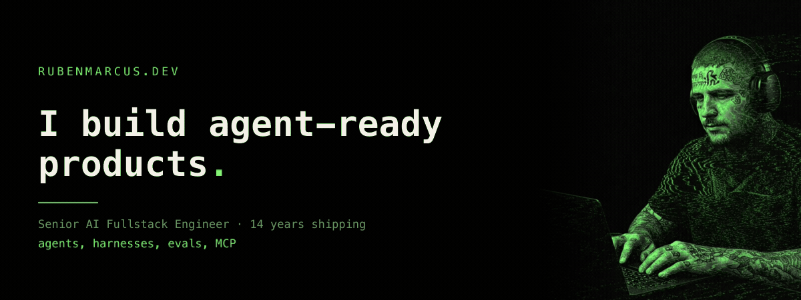
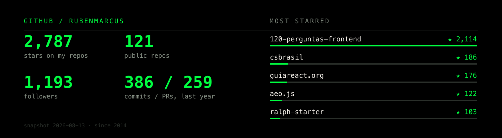

  

  
  
  
  
  
  
  

---

Senior AI engineer in Lisbon, remote worldwide. 14 years shipping: fintech and e-commerce first, 4+ years deep in web3, now AI-native products and agent tooling. I build agent systems and the loops that keep them honest: bounded specs, isolated worktrees, evals that fail closed.

At Quantum (MultiVM Labs) I led the AI engineering behind the **#1 result on ECDSA.fail** and the **#1 QEC decoder** on Optimization Arena, and I'm a co-author on the paper that came out of it: [ECDSA.Fail: Open Autoresearch](https://arxiv.org/abs/2609.09582) (arXiv:2609.09582). Before that, Bitte Protocol: a production agent runtime with 2.85M+ messages, 24,164 users and 16,703 deployed agents.

**This README speaks MCP.** Point your agent at `https://www.rubenmarcus.dev/api/mcp` and let it read the résumé instead of you: `get_resume`, `get_services`, `check_availability`, `book_intro`. Setup for Claude, ChatGPT, Cursor, Kimi and Codex lives in the [connect guide](https://www.rubenmarcus.dev/connect).

## Building now

  

**[Tupi](https://www.rubenmarcus.dev/demos/tupi/)** · Bertioga channel, 1554: Tupinambá canoes at dawn in real-time 3D (three.js WebGPU), built from prompts with cited historical research. My latest demo drop. The prompt that made it ships on the card.

| Project | What it is |
| --- | --- |
| **[ScanRepo](https://scanrepo.dev)** | Scan a repo before you clone it: credential stealers, supply-chain traps, fake recruiter scams. 31+ static rules, 6 risk categories, a 0 to 100 risk score, nothing cloned or executed. `npx scanrepo owner/repo` in CI. |
| **[AEO.js](https://aeojs.org)** | Answer Engine Optimization for JS sites: `llms.txt`, `ai-index.json`, AI-crawler policy analysis. Astro and Next plugins. |
| **[AEO Checker](https://check.aeojs.org)** | The free scanner on top of AEO.js. 4,569 scans across 2,259 sites. |
| **[CS Brasil](https://csbrasil.online)** | Browser FPS shipped through an agent gauntlet: measured baselines, critics that never grade their own work, A/B frame proof. 2,191 players, 27 countries. |

Earlier: Ralph Starter, Autoresearcher, Mirofi.sh, and the 14-year archive (Bitte, Grover, Zup/Itaú, Santander, agencies). [Full portfolio →](https://www.rubenmarcus.dev/portfolio)

  

## Writing

- [This portfolio is agents-welcome. Probably the first.](https://www.rubenmarcus.dev/blog/agents-welcome-portfolio)
- [Streaming 2.85M messages: the plumbing of a production agent chat](https://www.rubenmarcus.dev/blog/vercel-ai-sdk-streaming)
- [The AI harness behind the CS Brasil game](https://www.rubenmarcus.dev/blog/cs-brasil-ai-harness)
- [Routing 9 agent roles across 7 providers: the ECDSA.fail harness](https://www.rubenmarcus.dev/blog/openrouter-routing)

Every post ships in EN and PT, and every URL has a `.md` twin for agents. [All posts →](https://www.rubenmarcus.dev/blog)

## Hiring me

Selectively available for full-time roles and freelance contracts. Fixed scope preferred. I reply within a day or two.

- **[AI products & agent systems](https://www.rubenmarcus.dev/services/ai-product-systems)** · prototype to product, with evals and observability · 3 to 8 weeks
- **[AI-native frontend & design engineering](https://www.rubenmarcus.dev/services/ai-native-frontend)** · distinctive web product, quality held by the delivery loop · 2 to 6 weeks
- **[AEO audit & implementation](https://www.rubenmarcus.dev/services/aeo)** · make your site legible and citable to answer engines · 2 to 4 weeks

[ruben@rubenmarcus.dev](mailto:ruben@rubenmarcus.dev) · [contact](https://www.rubenmarcus.dev/contact) · or just let your agent call `book_intro`.
